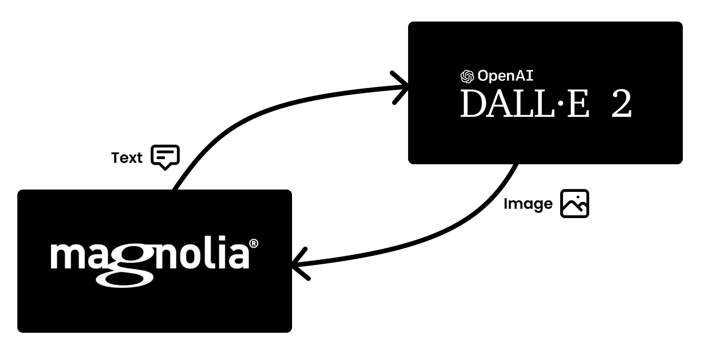
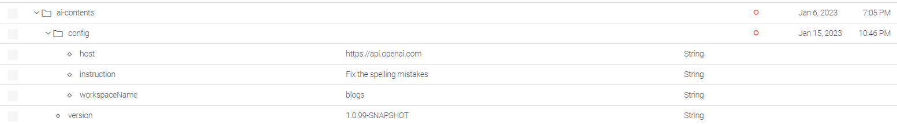
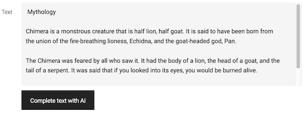
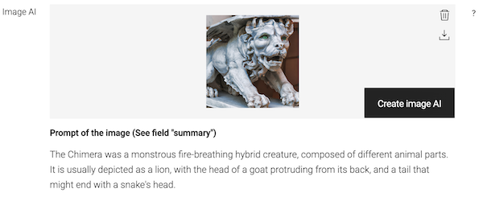

# Magnolia AI Contents


This project implements a set of features in [Magnolia CMS](https://www.magnolia-cms.com/) to create contents using [prompt engineering](https://en.wikipedia.org/wiki/Prompt_engineering) with [Open AI](https://openai.com/).

## Features
- Integration with [Open AI GPT](https://openai.com/blog/gpt-3-apps) and [Open AI DALL-E](https://openai.com/product/dall-e-2)
- UI field **textFieldAI** to create/edit text content using [Open AI GPT](https://openai.com/blog/gpt-3-apps).
- UI field **imageAI** to create images using [OpenAI DALL-E](https://openai.com/product/dall-e-2)
- Creation of fine-tuned models in [Open AI GPT](https://openai.com/blog/gpt-3-apps) for domain language defined from contents in [Magnolia CMS](https://www.magnolia-cms.com/)

## Modules
### ai-contents
Provides the following UI fields to create contents using AI:
- `textFieldAI` to write text using [Open AI](https://openai.com/)
- `imageAI` to generate images using [Open AI](https://openai.com/).
### ai-training
Provides a tool to train [fine-tuned](https://platform.openai.com/docs/guides/fine-tuning) models in [Open AI](https://openai.com/) from contents in [Magnolia CMS](https://www.magnolia-cms.com/).

### demo-ai-contents-app
Content app of Magnolia with examples using the fields `textFieldAI` and `imageAI`

### magnolia-ai-bundle-webapp
Example of a bundle of Magnolia using the modules **ai-contents** and **ai_training**

## Setup
1. Add dependency with the module **ai-contents**
```xml
<dependencies>
    <dependency>
        <groupId>org.formentor</groupId>
        <artifactId>ai-contents</artifactId>
        <version>${ai-contents.version}</version>
    </dependency>
    <dependency>
        <groupId>org.formentor</groupId>
        <artifactId>ai-training</artifactId>
        <version>${ai-contents.version}</version>
    </dependency>
</dependencies>
```
2. Set the environment variable _OPENAI_TOKEN_ with the _secret key_ used to authorize requests sent to the API of [Open AI](https://openai.com/)

```bash
export OPENAI_TOKEN=sk-...84jf
```

3. Configure the module in Magnolia
- Property **host** with the url of the API of [Open AI](https://openai.com/)
- Property **instruction** to specify the action to be done when editing text with [Open AI GPT](https://openai.com/blog/gpt-3-apps) - e.g. "Fix the spelling mistakes" -
- Property **workspace**(optional) to specify the name of the workspace of the content app. In case that you want to store the url of the image generated by  [OpenAI DALL-E](https://openai.com/product/dall-e-2)



> **IMPORTANT**
>
> **ai-contents** and **ai-training** are isolated modules, so remember to configure both modules.
>
> **ai-training** just requires the property _host_

## Field _textFieldAI_
Creates text content from a given prompt and edits text for given instructions.



Definition of field _textFieldAI_

```yaml
textAI:
  $type: textFieldAI
  words: 180
  performance: high
  strategy: completion
```
### Field properties
#### words
Specifies the number of words of the text created using AI.
#### performance
Indicates the performance of the prediction model. Allowed values:
- **best** 
- **high**
- **medium**
- **low**
> The integration with [Open AI](https://openai.com/) maps performance with models of [Open AI](https://openai.com/), - e.g. performance **best** uses the model _"text-davinci-003"_ and **low** uses _"text-ada-001"_ -
> 
> When using strategy `edit` it has to be used performance `best` because `edit` is supported only by the model _"text-davinci-edit-001"_ of OpenAI
#### strategy
Specifies the completion strategy to add text content using OpenAI. Allowed values:
- `completion` to write the text from a given prompt 
- `edit` to edit the text from given instruction
- `fix` to fix text with given instruction "Fix spelling mistakes in text" 
> When using strategy `edit` or `fix` it has to be used performance `best` because `edit` is supported only by the model _"text-davinci-edit-001"_ of OpenAI

## Field _imageAI_
Creates image content from a given prompt.



Definition of field _imageAI_

```yaml
imageAI:
  $type: imageAI
  promptProperty: summary
```
### Field properties

### Example
```yaml
subApps:
  detail:
    label: Blog
    form:
      properties:
        imageAI:
          $type: compositeField
          label: Image AI
          itemProvider:
            $type: jcrChildNodeProvider
            nodeName: jcr:content
            nodeType: mgnl:resource
          properties:
            image:
              label: ""
              $type: imageAI
```

## Training fine-tuned models in OpenAI GPT
The module _ai-training_ provides the command `ModelTrainerCommand` to create fine-tuned models in [Open AI GPT-3](https://openai.com/blog/gpt-3-apps)

Input parameters of `ModelTrainerCommand`
- **modelName** of the fine-tuned model created in [Open AI GPT-3](https://openai.com/blog/gpt-3-apps).
- **workspace** of the text contents used to build the training data.
- **root** path of the nodes to be used to build the examples of the training data.
- **nodeType** of the nodes to be used to build the examples of the training data.
- **propertiesAsPrompt** as the list of properties used to build the *prompt* in examples of the training data.
- **ropertyAsCompletion** as the origin property for the value of *completion* in examples of the training data. 

### Example
```groovy
cm = info.magnolia.commands.CommandsManager.getInstance()
command = cm.getCommand('ai','ModelTrainerCommand')

command.setWorkspace('tours')
command.setModelName('magnolia-tours')
command.setRoot('/magnolia-travels')
command.setNodeType('mgnl:content')
command.setPropertiesAsPrompt(['name', 'location', 'duration'])
command.setPropertyAsCompletion(['body'])

command.execute(new info.magnolia.context.SimpleContext())
```